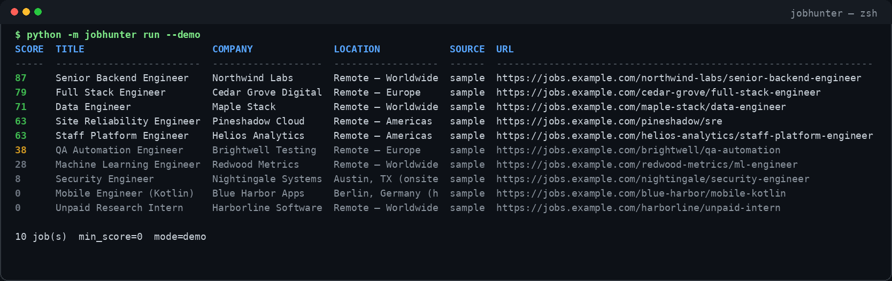

# ai-job-hunter

**A keyless CLI that hunts public job boards, verifies the links, and scores them against your profile.**

[](LICENSE)
[](#quickstart)
[](#quickstart)



Most job scrapers dump a pile of titles and hope you sort it. This one runs a short pipeline: collect from public APIs, drop duplicates, open each URL, score the fit, and (optionally) classify recruiter replies. Demo mode is fully offline. Live mode needs no credentials.

## Why

Job boards repeat the same posting across five aggregators. Half the links are already 404. The remaining ones may not match the role you actually want.

`ai-job-hunter` is a small, readable pipeline you can run locally or on a cron. Scoring is deterministic and testable. The optional language-model hook is a feature, not a requirement — if `LLM_API_KEY` is missing, classification stays on regex and says so.

## Architecture

```
 profile.example.json
          |
          v
 +------------+    +--------+    +--------+    +-------+    +-----------+
 |  sources   | -> | dedupe | -> | verify | -> | score | -> |  notify   |
 | arbeitnow  |    | url +  |    | HEAD / |    | 0-100 |    | telegram  |
 | remoteok   |    | title  |    | GET    |    | +why  |    | or stdout |
 | greenhouse |    +--------+    +--------+    +-------+    +-----------+
 +------------+                                      |
       demo: data/samples/                           +--> classify replies
       live: public HTTP, no secrets                     regex, optional LLM
```

## Features

- Three public, keyless sources (Arbeitnow, RemoteOK, Greenhouse boards)
- Dedup by normalized URL and fuzzy title+company, with a local seen-id store
- Link verification that follows redirects and drops 404/410
- Deterministic 0–100 profile score with human-readable reasons
- Recruiter-reply classifier: regex baseline + optional OpenAI-compatible hook
- Telegram notifier when env vars are present; otherwise a console table
- `run --demo` works offline from `data/samples/`
- Daily GitHub Action that publishes a JSON artifact — no repository secrets

## Quickstart

```bash
python3 -m venv .venv
.venv/bin/pip install -r requirements.txt
```

**Demo (offline, no network):**

```bash
.venv/bin/python -m jobhunter run --demo
.venv/bin/python -m jobhunter run --demo --min-score 60 --json
```

**Live (public APIs, still no keys):**

```bash
.venv/bin/python -m jobhunter run --live --min-score 60 --limit 20
```

**Classify a recruiter reply:**

```bash
.venv/bin/python -m jobhunter classify --text "Thanks for applying, we received your application."
.venv/bin/python -m jobhunter classify --file data/samples/replies.samples.json
```

`--llm` will call an OpenAI-compatible endpoint only when `LLM_API_KEY` is set. Without it, you get the regex baseline and a log line that says so.

```bash
.venv/bin/python -m pytest -q
```

## Configuration

Copy `.env.example` and export what you need. Nothing is required for demo mode.

| Variable | Required | Purpose |
| --- | --- | --- |
| `LLM_API_KEY` | no | Enables `classify --llm` |
| `LLM_BASE_URL` | no | OpenAI-compatible base (default `https://api.openai.com/v1`) |
| `LLM_MODEL` | no | Model name (default `gpt-4o-mini`) |
| `TELEGRAM_BOT_TOKEN` | no | Send the digest to Telegram instead of only printing it |
| `TELEGRAM_CHAT_ID` | no | Destination chat for the digest |
| `GREENHOUSE_BOARDS` | no | Comma-separated public board slugs (default `gitlab`) |

**Profile** (`profile.example.json`, or `--profile path`):

- `skills` — tokens that add points when they appear in the posting
- `roles` — phrases matched against the title
- `locations` — accepted locations when the role is not remote
- `remote_only` — cap the score when the posting is onsite-only
- `keywords` — extra positive terms
- `excluded_keywords` — hard penalty (internships, unpaid, …)
- `excluded_companies` — hard filter: drop jobs whose company matches any entry (case-insensitive substring)

Seen IDs are stored in `--seen path` (JSON). The file is optional and gitignored by default.

## Project structure

```
jobhunter/           pipeline package
  sources.py         public adapters, common fetch(limit) -> list[Job]
  dedupe.py          URL + title/company identity
  verify.py          HEAD/GET with redirects
  score.py           0-100 fit + reasons
  classify.py        regex baseline, optional LLM
  notify.py          Telegram or console
  cli.py             python -m jobhunter
data/samples/        fictitious jobs and recruiter replies
profile.example.json example scoring profile
tests/               pytest, no network
.github/workflows/   daily live hunt → report.json artifact
```

## How it works

1. **Collect.** Each adapter implements `fetch(limit) -> list[Job]`. A failing source is logged and skipped.
2. **Dedupe.** URLs are normalized (host, trailing slash, tracking params). Title+company pairs are hashed and compared with `difflib`.
3. **Verify.** HEAD, then GET if the board rejects HEAD. 404 and 410 are discarded; other failures are marked `error` and kept.
4. **Score.** Deterministic points for role, skills, location/remote, and keywords. Excluded terms collapse the score. Every point has a reason string.
5. **Notify.** If Telegram env vars exist, send a digest. The CLI always prints a table (or JSON).
6. **Classify.** Recruiter text is `simple_ack` or `needs_judgment`. Regex is the source of truth unless `--llm` and a live credential are both present.

Demo mode loads `data/samples/jobs.json` and skips HTTP verification so you can read the pipeline without keys or a network.

## Limitations

- Live results depend on third-party public APIs and rate limits.
- Greenhouse HTML layouts change; the adapter falls back to the public boards JSON API.
- Scoring is a heuristic, not a hiring decision.
- Link checks confirm the URL responds, not that the role is still accepting applications.
- The classifier is two-class on purpose. It will not draft replies for you.
- This repository ships fictitious sample listings only. Do not commit real applications, CVs, or chat identifiers.

## License

MIT. See [LICENSE](LICENSE).
